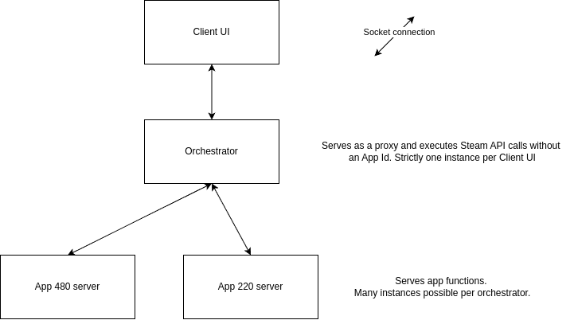

## Global architecture schema

The orchestrator part of this tool could be reused for farming account game time, or farming card drops.
It is highly modular, and it is easy to interface with from other Rust programs using Serde.

Communications are made via named sockets and work in a request-response fashion.
While crates like bincode could be used for performance gains, JSON was still chosen for its ease of use and human
readability.
It wasn't found that this posed a significant bottleneck.

The reason why the orchestrator doesn't execute the game functions itself is because
Steam will still show you as being "in game" as long as the game process you started didn't finish,
and its zombie process waited.

## Code folders

* backend
  * Orchestrator and app servers
* frontend
  * Client UI
* steam_client
  * Steamworks SDK bindings, used by the backend
* utils
  * Regular functions used by other modules, mostly for file path functions and IPC types.