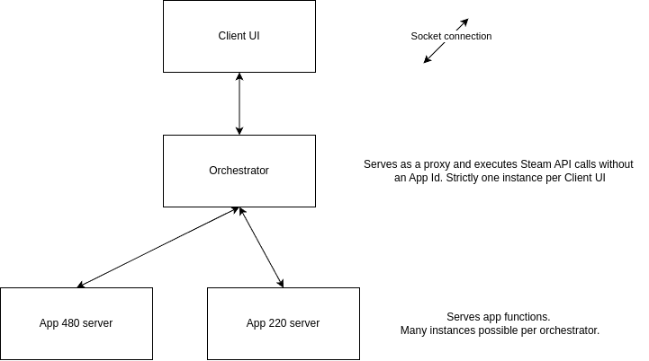

# SamRewritten — Architecture

## Process model



Three kinds of process. They are all the same binary (`samrewritten`); the
role is selected by command-line flags routed in `src/main.rs`.

* **Front-end** — one user-facing process. GUI build embeds GTK4; CLI build
  uses clap subcommands. This is the parent process the user actually
  launches.
* **Orchestrator** — long-lived child of the GUI front-end (spawned at
  startup with `--orchestrator`). Holds a Steam connection without an
  app id (for listing owned apps, etc.) and owns a refcounted map of
  live app-server children for idling and the manage view.
  *CLI builds do not spawn an orchestrator* — see "CLI mode" below.
* **App servers** — child processes invoked with `--app=<id>`. Each calls
  `SteamAPI_Init` for one specific app id and runs the command loop in
  `backend::app::app`. They can be long-lived (idling, manage view) or
  short-lived one-shots (bulk ops, single-app unlock/reset).

The orchestrator does not call Steam app functions itself because Steam
keeps "in-game" presence alive as long as the process holding the app's
Steamworks handle is alive (and not reaped). Each app server is therefore
the "I'm running game X" presence holder.

## Inter-process communication

* Each parent ↔ child link is two `interprocess::unnamed_pipe` pipes, one
  per direction, wrapped in `utils::bidir_child::BidirChild`. Pipe file
  descriptors / handles are passed to the child via `--tx=` / `--rx=`
  args.
* Messages are length-prefixed JSON-serialized `SteamCommand` requests and
  `SteamResponse<T>` replies (`utils::ipc_types`). JSON was chosen over a
  binary codec for ease of inspection; it has not been a bottleneck.
* The GUI's high-level wrapper is the `Request` trait in
  `gui_frontend::request`: each request type maps to one `SteamCommand`
  and declares its response shape. A global `DEFAULT_PROCESS` holds the
  single orchestrator `BidirChild`; `Request::request()` takes a write
  lock to serialize traffic on that pipe.

## Bulk operations

For multi-app operations (export, import, mass unlock, mass reset):

* The front-end builds a `Vec<(app_id, SteamCommand)>` and calls
  `backend::progress_io::run_command_on_apps_concurrent`.
* The helper spawns up to `MAX_CONCURRENT_APPS` (= 30) `samrewritten
  --app=<id>` workers in parallel using `std::thread::scope`, chunked in
  batches of that size. Each worker:
  1. sends the per-app `SteamCommand`,
  2. reads the response bytes,
  3. sends `Shutdown`,
  4. waits the child.
* Result is `Vec<(app_id, Result<Vec<u8>, SamError>)>`. Callers parse the
  bytes via `parse_response_bytes::<T>` for whatever `T` the child
  returns (e.g. `bool` for unlock, `AppExport` for export, `ImportSummary`
  for import).

**Bulk operations bypass the orchestrator.** The orchestrator only
mediates long-lived per-app state (idling, the single-app manage view)
and the parent-side `ConnectedSteam` used for library listing. For
one-shot fan-out, the orchestrator adds nothing — going through it would
just serialize the requests on the orchestrator pipe and block other GUI
actions.

This means the same machinery serves bulk ops in both GUI and CLI: hand
`run_command_on_apps_concurrent` a list of `(app_id, SteamCommand)` and
deserialize the responses. No new IPC variants are required for future
bulk ops.

### The 30-app cap

`MAX_CONCURRENT_APPS = 30` is empirical, not documented by Valve. Past
~30 concurrent `SteamAPI_Init` clients, Steam silently drops in-game
presence (multiple idler tools — Idle Master Extended, Steam Game Idler,
ASF — converge on the same number). The same constant gates:

* **The GUI's "max apps you can idle at once"** — cards whose app isn't
  already idling have their idle button greyed out when the cap is
  reached. Mechanism: `GSteamAppObject.can_start_idling: bool` property,
  recomputed across the store by `recompute_idle_cap` after every idle
  toggle and after the `GetRunningApps` sync; cards bind
  `idle_button.sensitive` to a closure expression
  `is_idling || can_start_idling`.
* **The bulk-op helper's concurrency cap.**

The GUI re-exports the constant as `MAX_CONCURRENT_IDLE`; both names
refer to the same value.

## CLI mode

For interactive single-app commands (`samrewritten idle 440`,
`samrewritten unlock-all 440`, `samrewritten list-achievements 440`,
etc.), the CLI is one process doing one app's work directly via
`AppManager` (no orchestrator, no child spawning).

For bulk commands (`samrewritten export 440 730 570`,
`samrewritten import file.json`), the CLI uses
`run_command_on_apps_concurrent` directly. It spawns up to 30 app-server
children in parallel, exactly like the GUI's bulk path.

`main.rs` routes `--app=<id>` in both feature builds, so a worker spawned
by either the GUI or the CLI runs the same app-server loop
(`backend::app::app`).

## Progress export/import format

`samrewritten export` and the GUI's "Export selected apps progress" produce:

```json
{
  "format_version": 1,
  "exported_at": "2026-05-14T10:30:00Z",
  "apps": [
    {
      "app_id": 440,
      "app_name": "Team Fortress 2",
      "achievements": [
        {"id": "...", "is_achieved": true, "permission": 0}
      ],
      "stats": [
        {"id": "...", "value": {"int": 100}, "permission": 0},
        {"id": "...", "value": {"float": 0.85}, "permission": 2}
      ]
    }
  ]
}
```

`permission` is preserved so the import side detects fields Steam will
refuse to write:

* stats with `permission & 2 != 0` (PROTECTED bit)
* achievements with `permission != 0` (any flag set: game-server,
  developer)

Protected fields are always skipped client-side on import. The GUI prompts
the user when any selected app contains protected fields, with "Skip
these apps" / "Proceed anyway" choices. The CLI does the same skip
silently (non-interactive).

`unlock_time` is intentionally not exported: Steam stamps a fresh time
on unlock and arbitrary past timestamps can't be restored.

The file format struct and ISO 8601 helper live in
`utils::export_file` (shared between GUI and CLI; the CLI build has no
glib so it uses a hand-rolled UTC formatter).

## Settings (GSettings)

Schema id `org.samrewritten.SamRewritten`
(`assets/org.samrewritten.SamRewritten.gschema.xml`). The schema is
recompiled into `assets/gschemas.compiled` by `build.rs` whenever the
XML changes. Current keys:

* `filter-junk` (b) — hide junk entries in the app list.
* `app-theme` (s) — `'system' | 'light' | 'dark'`.
* `app-sort` (s) — `'app_id' | 'alphabetical' | 'last_played' | 'playtime'`.
* `disable-animations` (b) — disables the card hover image-pan effect.

Loading paths (`gui_frontend::gsettings::get_settings`): `$APPDIR`
(AppImage), `./assets` (dev), `$SAM_GSCHEMA_DIR_FALLBACK`, then the
default system path (`Settings::new(APP_ID)`). The snap build installs
the compiled schema into `$SNAP/usr/share/glib-2.0/schemas/` via the
`snapcraft.yaml` `override-build` step.

## Adding a new per-app command

1. Add a `SteamCommand` variant in `utils/ipc_types.rs`.
2. Handle it in `backend/app.rs` — that's the app-server loop.
3. Then choose:
   * **Single-app, long-lived child** (e.g. set one achievement on the
     currently-managed app): also add a handler in
     `backend/orchestrator.rs` that forwards the command to the existing
     child (or spawns a one-shot), and a `Request` impl in
     `gui_frontend/request.rs`.
   * **Bulk fan-out**: no IPC additions needed beyond the per-app
     variant. Build a `Vec<(app_id, SteamCommand)>` and call
     `run_command_on_apps_concurrent` from the front-end.

## Code folders

* **`backend/`** — Steam-facing code, shared between feature builds.
  * `orchestrator.rs` — orchestrator process loop and command dispatch.
  * `app.rs` — app-server process loop.
  * `app_manager.rs` — Steam app interface wrapping `ConnectedSteam`.
  * `app_lister.rs` — owned-apps query.
  * `connected_steam.rs` — RAII wrapper over the Steamworks pipe.
  * `progress_io.rs` — `MAX_CONCURRENT_APPS`,
    `run_command_on_apps_concurrent`, `parse_response_bytes`, and the
    per-app `collect_app_export` / `apply_app_export` helpers used by
    app servers.
  * `stat_definitions.rs` — `AchievementInfo`, `StatInfo` (Int/Float),
    permission bit semantics.
  * `local_config.rs` — `localconfig.vdf` parser (playtime, last-played).
* **`gui_frontend/`** — only built with `--features gui` (the default).
  * `app_list_view/` — main grid, search, sort, idle toggle, manage
    button, the bulk-process actions (`bulk_actions.rs`,
    `progress_actions.rs`, `refresh_actions.rs`), and the
    `settings_bindings.rs` GSettings glue.
  * `app_view.rs` — single-app manage view (achievements + stats lists).
  * `widgets/` — custom GTK widgets including `SteamAppCard` (hover
    image-pan animation, idle button, sensitivity binding) and
    `ShimmerImage` (async-loaded shimmer-while-loading texture).
  * `gobjects/steam_app.rs` — `GSteamAppObject`, the per-app GObject
    model holding `app_id`, `app_name`, `is_idling`, `can_start_idling`,
    etc.
  * `gsettings.rs` — schema loader handling AppImage / Snap / system
    paths.
* **`cli_frontend/`** — only built with `--no-default-features --features cli`.
  * Clap subcommands. Talks directly to `AppManager` for single-app ops;
    uses `run_command_on_apps_concurrent` for bulk.
* **`steam_client/`** — raw Steamworks SDK bindings used by `backend`.
* **`utils/`** — feature-agnostic helpers.
  * `ipc_types.rs` — `SteamCommand`, `SteamResponse`, `AppExport`,
    `ImportSummary`, `SamError`, the `SamSerializable` trait.
  * `bidir_child.rs` — `BidirChild` (child + two pipes).
  * `arguments.rs` — `--orchestrator`, `--app=`, `--tx=`, `--rx=` parsing.
  * `app_paths.rs`, `steam_locator.rs` — install path discovery.
  * `export_file.rs` — `ExportFile`, `iso8601_utc_now`, `FORMAT_VERSION`.

## Build features

* `default = ['gui']` — GTK4 only.
* `gui = ['dep:gtk']` — GTK4 build.
* `adwaita = ['gui', 'dep:adw']` — GTK4 + libadwaita.
* `cli = ['dep:clap']` — CLI build. Mutually exclusive with `gui`;
  `main.rs` enforces this with `compile_error!`.
* `win-console = ['gui']` — Windows GUI with a console window attached
  (debugging).
